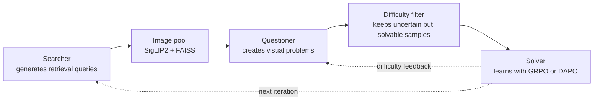

# Active-Zero

Active-Zero is a research codebase for self-improving vision-language reasoning. It co-evolves three roles—**Searcher**, **Questioner**, and **Solver**—to discover useful images, generate appropriately difficult visual questions, and train a stronger multimodal reasoner without relying on a fixed question set.

This README adapts the main [`README.md`](README.md) to use [The Cauldron](https://huggingface.co/datasets/HuggingFaceM4/the_cauldron) as the source image pool. The training, self-play, evaluation, and troubleshooting instructions are otherwise unchanged.

The reinforcement-learning stack is built on [EasyR1](https://github.com/hiyouga/EasyR1) and [veRL](https://github.com/volcengine/verl), with distributed generation powered by [Ray](https://github.com/ray-project/ray) and [vLLM](https://github.com/vllm-project/vllm).

> [!IMPORTANT]
> This repository is research code. The provided launchers reproduce the authors' cluster layout and still contain several machine-specific paths and fixed GPU assumptions. Read [Configuration checklist](#configuration-checklist) before launching a run.

## Method overview



| Role | Input | Objective | Main implementation |
| --- | --- | --- | --- |
| Searcher | Text-only sampling prompts | Produce diverse queries that retrieve useful source images | [`selfplay/searcher/`](selfplay/searcher/) |
| Questioner | Retrieved images | Generate diverse questions whose answers are neither trivial nor impossible for the current solver | [`selfplay/questioner/`](selfplay/questioner/) |
| Solver | Filtered image-question-answer samples | Improve visual reasoning and answer accuracy | [`selfplay/solver/`](selfplay/solver/) |

One iteration performs the following steps:

1. Train the Searcher with feedback from the retriever, Questioner, and Solver services.
2. Use the Searcher to retrieve images from a large source pool.
3. Train the Questioner on the selected images using solver uncertainty and diversity rewards.
4. Generate candidate questions, estimate answer consistency with the Solver, and retain samples whose consistency score is in `[0.3, 0.8]`.
5. Train the Solver on the filtered local dataset.
6. Feed the updated checkpoints into the next iteration.

## Highlights

- Three-role self-play for automatic visual curriculum construction.
- Text-to-image retrieval with SigLIP2 embeddings and a FAISS inner-product index.
- Difficulty-aware sample filtering based on solver answer consistency.
- GRPO and DAPO training through the included EasyR1/veRL stack.
- Distributed training, data generation, retrieval, and evaluation with Ray and vLLM.
- Support for local Hugging Face datasets and Hub datasets using `dataset@split` syntax.
- Evaluation scripts for multimodal math, general VQA, and hallucination benchmarks.

## Repository layout

```text
Active-Zero/
├── selfplay/
│   ├── searcher/                 # retrieval-query training and image search
│   ├── questioner/               # question generation, scoring, and training
│   ├── solver/                   # solver training and reward
│   └── main*.sh                  # multi-iteration orchestration
├── tool/
│   ├── process_cauldron.py       # The Cauldron image-pool builder
│   ├── process_dataset.py        # evaluation and dummy dataset builders
│   └── retriever/                # source-pool merge and FAISS index tools
├── Evaluation/                   # distributed inference and accuracy scripts
├── train_examples/               # EasyR1 training examples and base config
├── val_examples/                 # validation-only launcher
├── scripts/model_merger.py       # FSDP checkpoint to Hugging Face conversion
├── verl/                         # bundled RL training framework
├── requirements.txt
└── setup.py
```

## Requirements

The dependency pins and launch scripts target the following environment:

- Linux with NVIDIA GPUs and CUDA 12.x.
- Python 3.11 is recommended; the package declares Python 3.9+.
- PyTorch 2.6.0 with CUDA 12.4.
- vLLM 0.8.4.
- Transformers 4.54.0–4.57.0.
- FlashAttention 2.7.4.post1 or another build compatible with the installed PyTorch/CUDA ABI.
- FAISS with GPU support.
- A shared filesystem visible from every Ray node.

The default scripts assume **8 GPUs per node**. The standard GRPO Solver launcher requests 2 nodes, while the DAPO Solver launcher requests 1 node. Generation scripts may create up to 16 one-GPU Ray tasks; adapt these values to the available cluster.

> [!NOTE]
> The root [`Dockerfile`](Dockerfile) comes from a newer upstream EasyR1 environment and currently uses a different PyTorch/vLLM stack from [`requirements.txt`](requirements.txt). For reproduction, use the pinned native installation below unless you intentionally reconcile those versions.

## Installation

```bash
git clone https://github.com/jinghan1he/Active-Zero.git
cd Active-Zero

conda create -n active-zero python=3.11 -y
conda activate active-zero

conda install -c pytorch -c nvidia -c conda-forge faiss-gpu=1.13.2 -y

pip install torch==2.6.0 torchvision==0.21.0 torchaudio==2.6.0 \
  --index-url https://download.pytorch.org/whl/cu124

pip install \
  https://github.com/Dao-AILab/flash-attention/releases/download/v2.7.4.post1/flash_attn-2.7.4.post1+cu12torch2.6cxx11abiFALSE-cp311-cp311-linux_x86_64.whl

pip install -e .
pip install transformers==4.57.0
```

If Hugging Face access is slow in your environment, set a mirror before downloading models or datasets:

```bash
export HF_ENDPOINT=https://hf-mirror.com
```

Verify the core imports:

```bash
python - <<'PY'
import faiss
import ray
import torch
import transformers
import vllm

print("torch:", torch.__version__)
print("transformers:", transformers.__version__)
print("vllm:", vllm.__version__)
print("cuda devices:", torch.cuda.device_count())
print("faiss gpus:", faiss.get_num_gpus())
PY
```

## Data preparation

Active-Zero uses three data artifacts:

1. A source image pool in Hugging Face `Dataset.save_to_disk` format.
2. A FAISS index whose row order exactly matches the source pool.
3. Dummy text datasets used to drive Searcher rollouts.

### 1. Build a source image pool from The Cauldron

The repository contains [`tool/process_cauldron.py`](tool/process_cauldron.py), which is intended to:

1. Enumerate the configurations of `HuggingFaceM4/the_cauldron`.
2. Stream each configuration instead of downloading the complete dataset cache first.
3. Retain rows containing exactly one image and save that image as JPEG.
4. Flatten all saved images into a Hugging Face dataset whose `answer` column is the global image row ID.

The checked-in helper skips the `clevr_math` and `okvqa` configurations. Question/answer text from The Cauldron is not copied because the dataset is used only as a raw image pool; Active-Zero generates new questions during training.

#### Configure the output path

Set `BASE_DATA_DIR` in [`tool/process_cauldron.py`](tool/process_cauldron.py) to a shared absolute path:

```python
DATASET_NAME = "HuggingFaceM4/the_cauldron"
BASE_DATA_DIR = "/absolute/path/to/the_cauldron"
```

`process_the_cauldron()` has no per-configuration row or image limit. It streams every available training row from each included configuration, retains every single-image sample, and runs until that configuration is exhausted. Images are named with their original streaming row index; existing files are skipped, so rerunning the function resumes safely without overwriting downloaded images.

#### Download images

Run the streaming download from the repository root:

```bash
cd /absolute/path/to/Active-Zero

python - <<'PY'
from tool.process_cauldron import process_the_cauldron

process_the_cauldron()
PY
```

> [!WARNING]
> The full run can be very large and slow because it processes every available row from every included The Cauldron configuration. Confirm disk capacity, inode availability, Hugging Face cache capacity, and job wall-time before starting. Streaming avoids materializing the full source dataset in the Hugging Face cache, but every retained image is still written to `BASE_DATA_DIR`.

Check the downloaded image count:

```bash
export CAULDRON_ROOT=/absolute/path/to/the_cauldron

find "$CAULDRON_ROOT" \
  -mindepth 2 \
  -maxdepth 2 \
  -type f \
  -name '*.jpg' | wc -l
```

#### Construct the flattened source dataset

After downloading the images, run the existing `construct_dataset()` function:

```bash
python - <<'PY'
from tool.process_cauldron import construct_dataset

construct_dataset()
PY
```

`construct_dataset()` sorts configuration directories and numeric JPEG filenames, assigns a contiguous global row ID, and saves the result to `BASE_DATA_DIR/data1`.

> [!NOTE]
> `Dataset.save_to_disk()` does not overwrite an existing populated `data1/` directory. For a rebuild, archive the old output or change the destination in `construct_dataset()` before running it again. Also avoid placing unrelated immediate child directories containing JPEGs below `BASE_DATA_DIR`, because the constructor scans every immediate child.

The resulting layout is:

```text
the_cauldron/
├── <configuration-a>/
│   ├── 0.jpg
│   ├── 1.jpg
│   └── ...
├── <configuration-b>/
│   └── ...
└── data1/                         # SOURCE_DATASET points here
    ├── dataset_info.json
    ├── state.json
    └── ...
```

Each row in `data1/` has the following schema:

```python
{
    "problem": "",                  # empty for a raw image pool
    "images": ["/absolute/image/path.png"],
    "answer": "123",               # string form of this row's global index
}
```

The `answer == row index` invariant is required: the role services pass this value between processes as the image identifier.

### 2. Build the FAISS index for The Cauldron

Edit `data_path` and `index_path` in [`tool/retriever/construct_index.py`](tool/retriever/construct_index.py):

```python
data_path = "/absolute/path/to/the_cauldron/data"
index_path = "/absolute/path/to/the_cauldron/the_cauldron.index"
```

Then build the index:

```bash
python tool/retriever/construct_index.py
```

The checked-in index builder already targets `the_cauldron/data` and `the_cauldron.index`, but its paths are author-local and still need to be replaced. The index is created with `google/siglip2-so400m-patch16-naflex` and `faiss.IndexFlatIP`. Do not reorder, append to, or rebuild `data1/` without also rebuilding the index; retrieved FAISS row IDs are used directly as dataset row IDs.

### 3. Create Searcher dummy datasets

The Searcher does not consume real prompts during rollout, but the trainer still needs non-empty datasets. Create the default 1,000,000-row training set and 1,000-row validation set:

```bash
export DATA_ROOT=/absolute/path/to/data

python - <<'PY'
import os
from tool.process_dataset import dummy_dataset_for_searcher

root = os.environ["DATA_ROOT"]
dummy_dataset_for_searcher(1_000_000, os.path.join(root, "dummy_dataset_1m"))
dummy_dataset_for_searcher(1_000, os.path.join(root, "dummy_dataset_1k"))
PY
```

Update the two author-local paths in [`selfplay/searcher/searcher_train.sh`](selfplay/searcher/searcher_train.sh) to these directories.

### 4. Create a Questioner validation subset

The checked-in Questioner launchers refer to an author-local `R1-Onevision-Val` path. A reproducible replacement is a small subset of the source pool; preserve the original `answer` values so they still identify rows in the full pool.

```bash
export SOURCE_DATASET=/absolute/path/to/the_cauldron/data
export QUESTIONER_VAL=/absolute/path/to/data/questioner_val_1k

python - <<'PY'
import os
from datasets import load_from_disk

source = load_from_disk(os.environ["SOURCE_DATASET"])
source.select(range(min(1_000, len(source)))).save_to_disk(os.environ["QUESTIONER_VAL"])
PY
```

Replace `data.val_files=/path/to/data_cache/R1-Onevision-Val` in both Questioner training scripts with the absolute `QUESTIONER_VAL` path:

- [`selfplay/questioner/questioner_train.sh`](selfplay/questioner/questioner_train.sh)

### 5. Prepare evaluation datasets

[`tool/process_dataset.py`](tool/process_dataset.py) downloads and normalizes the evaluation datasets used by the benchmark launcher:

```bash
python tool/process_dataset.py
```

Prepared datasets are saved below `Evaluation/Datasets/`. The script downloads multiple large public datasets, so make sure the repository filesystem has sufficient capacity.

## Configuration checklist

### Environment variables

Set these variables on the head node and propagate them to every Ray worker:

| Variable | Meaning | Example |
| --- | --- | --- |
| `STORAGE_PATH` | Shared directory for checkpoints, generated data, temporary files, and logs | `/shared/experiments/selfplay_vl` |
| `SOURCE_DATASET` | Flattened The Cauldron image pool created above | `/shared/data/the_cauldron/data` |
| `INDEX_PATH` | FAISS index aligned with `SOURCE_DATASET` | `/shared/data/the_cauldron/the_cauldron.index` |
| `VLLM_HOST` | Host serving the role HTTP endpoints; defaults to loopback | `127.0.0.1` for single-node services |

```bash
export STORAGE_PATH=/absolute/shared/path/to/selfplay_outputs
export SOURCE_DATASET=/absolute/path/to/the_cauldron/data
export INDEX_PATH=/absolute/path/to/the_cauldron/the_cauldron.index
export VLLM_HOST=127.0.0.1

mkdir -p "$STORAGE_PATH"
```

For multi-node runs, all nodes must see the same absolute paths. `VLLM_HOST` must resolve from the process executing the reward function to the node on which the eight role services are listening.

### Paths to replace

Search for author-local paths before launching:

```bash
rg -n '/home/hejinghan' selfplay tool Evaluation
```

At minimum, update:

- Searcher dummy train/validation paths in `selfplay/searcher/searcher_train.sh`.
- Questioner validation paths in `selfplay/questioner/questioner_train.sh`.
- `BASE_DATA_DIR` in `tool/process_cauldron.py`.
- `data_path` and `index_path` in `tool/retriever/construct_index.py`.

Model names, checkpoint steps, batch sizes, node counts, and output experiment names are configured directly in the `selfplay/*.sh` and role training scripts.

### GPU and port assumptions

The service launchers start one worker on each of GPUs `0..7` and use these local port ranges:

| Service | Ports | Launcher |
| --- | --- | --- |
| Questioner | `5000`–`5007` | `selfplay/questioner/vllm_server/start.sh` |
| Solver | `6000`–`6007` | `selfplay/solver/vllm_server/start.sh` |
| Retriever | `7000`–`7007` | `selfplay/searcher/retriever_vllm_server/start.sh` |

If a node has a different number of GPUs, change both the `{0..7}` loops in the server launchers and the corresponding `num_workers=8` values in the reward functions. Also review:

- `trainer.n_gpus_per_node` and `trainer.nnodes` in the training config/launchers.
- `num_workers` in image search and evaluation.
- `num_nodes` in Questioner generation/evaluation; despite its name, this value controls the number of one-GPU Ray shards.
- `tensor_parallel_size` and batch sizes in `train_examples/config.yaml`.

## Start Ray

All generation and training entrypoints expect an existing Ray cluster because they connect with `address="auto"`.

Single node:

```bash
ray start --head --port=6379 --dashboard-host=0.0.0.0
ray status
```

Multi-node setup:

```bash
# Head node
ray start --head --port=6379 --dashboard-host=0.0.0.0

# Each worker node
ray start --address=<head-node-ip>:6379

# Verify from the head node
ray status
```

Launch the orchestration script only on the head node.

## Run self-play

The DAPO launcher is the most self-contained checked-in entrypoint. By default it starts from `Qwen/Qwen2.5-VL-3B-Instruct`, runs three Searcher → Questioner → Solver iterations, and evaluates each Solver checkpoint:

```bash
bash selfplay/main_dapo.sh
```

The role scripts automatically skip a stage when its expected merged Hugging Face checkpoint already exists, which allows interrupted experiments to resume at stage boundaries.

Available orchestration variants:

| Script | Default setup | Purpose |
| --- | --- | --- |
| `selfplay/main_dapo.sh` | Qwen2.5-VL-3B, DAPO Solver | Main single-node Solver configuration |

To run stages manually:

```bash
# Searcher: current Searcher, Questioner, Solver, output name
bash selfplay/searcher/searcher_train.sh \
  Qwen/Qwen2.5-VL-3B-Instruct \
  Qwen/Qwen2.5-VL-3B-Instruct \
  Qwen/Qwen2.5-VL-3B-Instruct \
  Qwen2.5-VL-3B-Instruct_searcher_v1

# Questioner: current Questioner, trained Searcher, current Solver, output name
bash selfplay/questioner/questioner_train.sh \
  Qwen/Qwen2.5-VL-3B-Instruct \
  "$STORAGE_PATH/models/Qwen2.5-VL-3B-Instruct_searcher_v1/global_step_10/actor/huggingface" \
  Qwen/Qwen2.5-VL-3B-Instruct \
  Qwen2.5-VL-3B-Instruct_questioner_v1

# Solver: current Solver, trained Searcher, trained Questioner, output name
bash selfplay/solver/solver_train_dapo.sh \
  Qwen/Qwen2.5-VL-3B-Instruct \
  "$STORAGE_PATH/models/Qwen2.5-VL-3B-Instruct_searcher_v1/global_step_10/actor/huggingface" \
  "$STORAGE_PATH/models/Qwen2.5-VL-3B-Instruct_questioner_v1/global_step_10/actor/huggingface" \
  Qwen2.5-VL-3B-Instruct_solver_v1
```

## Outputs and checkpoints

A run writes the following artifacts below `STORAGE_PATH`:

```text
selfplay_outputs/
├── generated_question/           # raw questions, solver-consistency results, histograms
├── local_train_dataset/          # filtered Solver training datasets and summary.json
├── logs/vllm_server/             # Questioner, Solver, and Retriever service logs
├── models/                       # FSDP checkpoints and merged HF models
│   └── <experiment>/
│       └── global_step_<N>/actor/huggingface/
├── searched_image/               # generated queries, retrieval results, selected indices
└── temp_results/                 # file-based role-service requests and responses
```

`scripts/model_merger.py` converts each saved FSDP actor checkpoint into the `actor/huggingface/` directory expected by the next role and iteration.

## Evaluation

After preparing `Evaluation/Datasets/` and starting Ray, run distributed deterministic generation:

```bash
export EXPERIMENT_NAME=Qwen2.5-VL-3B-Instruct_solver_v1
export MODEL_PATH="$STORAGE_PATH/models/$EXPERIMENT_NAME/global_step_30/actor/huggingface"

bash Evaluation/eval_gen_questions.sh "$EXPERIMENT_NAME" "$MODEL_PATH"
```

Raw predictions are written to:

```text
Evaluation/Raw-Outputs/<experiment>/<dataset>.jsonl
```

> [!WARNING]
> Before aggregate scoring, remove the duplicated third path from the `HallusionBench` entry in `Evaluation/eval_boxed_accuracy.py`; the current three-item tuple cannot be unpacked by the evaluator loop.

Compute aggregate accuracy with MathRuler matching:

```bash
python Evaluation/eval_boxed_accuracy.py --model "$EXPERIMENT_NAME"
```

The summary is saved to `Evaluation/Results/<experiment>_exact_match.txt`.

Optional LLM judging uses DeepSeek's OpenAI-compatible endpoint:

```bash
pip install openai python-dotenv
export DS_API_KEY=<your-api-key>
python Evaluation/eval_boxed_accuracy.py \
  --model "$EXPERIMENT_NAME" \
  --use_llm_judge
```

## Using a custom source dataset

A custom source pool can be a local Hugging Face dataset directory or a Hub dataset. It must contain:

- `images`: a sequence containing one PIL image or image path per row.
- `problem`: a string; it may be empty for the raw source pool.
- `answer`: the string form of the row's index in the full, unshuffled source pool.

Build the FAISS index from the same final row order and point `SOURCE_DATASET` and `INDEX_PATH` at the matching pair. If image paths are used, prefer absolute paths because datasets and services may run on different nodes.

Training/evaluation datasets consumed directly by EasyR1 use the same `problem`, `images`, and `answer` columns, but `answer` contains the actual ground-truth answer rather than an image row ID.

## Troubleshooting

### A role server does not respond

Inspect the service logs under `$STORAGE_PATH/logs/vllm_server/`, confirm that ports `5000`–`7007` are reachable, and verify that `VLLM_HOST` is correct. The launchers use file paths in HTTP requests, so the service and caller must share the same filesystem.

### Ray tasks remain pending

Run `ray status` and compare available GPU resources with `num_workers`, `num_nodes`, `trainer.nnodes`, and `trainer.n_gpus_per_node`. The defaults target an 8-GPU-per-node cluster.

### CUDA out of memory

Reduce `worker.rollout.gpu_memory_utilization`, rollout/mini-batch sizes, `max_pixels`, or `max_response_length`. Parameter and optimizer offloading are configured under `worker.actor.offload` in `train_examples/config.yaml`.

### Image features and image tokens do not match

Increase `data.max_prompt_length` or reduce `data.max_pixels` in `train_examples/config.yaml` and the matching generation scripts.

### The retriever returns incorrect images

Rebuild the FAISS index after any source dataset change. `INDEX_PATH` and `SOURCE_DATASET` must use identical row ordering, and every source row's `answer` must equal its row index.

### A stage is skipped unexpectedly

Stage completion is detected by the existence of a merged checkpoint such as `global_step_10/actor/huggingface` or `global_step_30/actor/huggingface`. Use a new experiment name or inspect the existing checkpoint directory.

## Current research-code notes

- Several preprocessing and training files retain `/path/to/...` paths and must be adapted to your filesystem.
- Server launchers call `pkill -f` for existing Questioner/Solver service processes and assume exclusive use of the node.
- `selfplay/main.sh` contains a duplicated Solver command in the iteration loop; correct that invocation before using the GRPO orchestration path.
- `Evaluation/eval_boxed_accuracy.py` currently has a duplicate third value in the `HallusionBench` dataset mapping; remove that duplicate path before running aggregate scoring.
- Generated outputs and evaluation datasets are ignored by Git; keep independent backups of important experiment artifacts.

## Acknowledgements

Active-Zero builds on the training infrastructure of [EasyR1](https://github.com/hiyouga/EasyR1) and [veRL](https://github.com/volcengine/verl). It also relies on vLLM, Ray, Hugging Face Transformers/Datasets, SigLIP2, and FAISS. We thank the authors and maintainers of these projects and the public datasets used by the data preparation scripts.

## License

This repository is released under the [Apache License 2.0](LICENSE).

## Citation

If this code is useful in your research, please cite our paper:

```bibtex
@article{he2026active,
  title   = {Active Zero: Self-Evolving Vision-Language Models through Active Environment Exploration},
  author  = {Jinghan He and Junfeng Fang and Feng Xiong and Zijun Yao and Fei Shen and Haiyun Guo and Jinqiao Wang and Tat-Seng Chua},
  journal = {arXiv preprint arXiv:2602.11241},
  year    = {2026},
  url     = {https://arxiv.org/abs/2602.11241}
}
```
